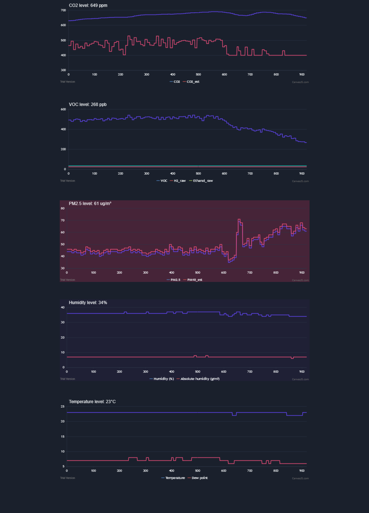
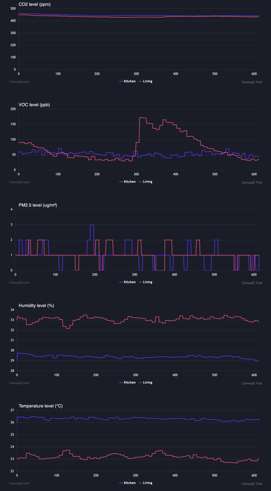

Self-updating charts in your browser generated from the local sensors of your Awair Element air quality monitor device.

Be sure to **enable the Local API feature** of your Awair ([see the documentation](https://support.getawair.com/hc/en-us/articles/360049221014-Awair-Local-API-Feature)), and to **set your Awair's IP address(es) on the top of the HTML file**.

Use
1. *awair_monitor.html* for 1 Awair device
2. *awair_monitor_for_2_devices.html* for 2 Awair devices

Here is how it looks:

1 device version:

2 devices version:

 
