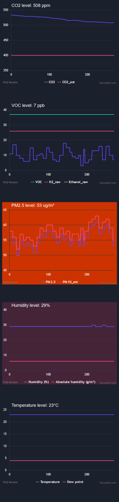

Self-updating charts in your browser generated from the local sensors of your Awair Element air quality monitor device.

Be sure to enable the Local Sensors feature in the Developer Options, and to set your Awair's IP address at the top of the HTML file. 
 
Here is how it looks:

 
